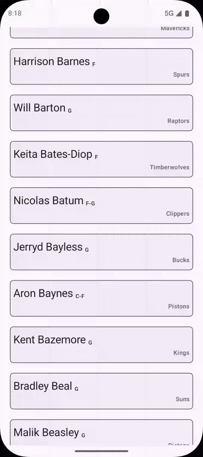

# MonetaApp

<p>
  
  
</p>

## Api
I am using the [balldontlie.io](https://www.balldontlie.io/) API as requested.

As this is just a demo app that will not be shipped, I didn't attempt to hide the key.
But it's not in git, as that would be very, very bad...

Your API key goes to `local.properties`, if you miss this, Gradle will fail to build.
```
balldontlieApiKey=<your api key>
```

## Arch
Simple clean-arch like 🤷‍♂️.

## MVVM
I grabbed the `AbstractViewModel` from one of my hobby projects as it extends the Android `ViewModel()` and adds view state handling.

Showcasing in the `PlayersViewModel` where
  - use cases are called
  - view state is being produced
  - intents from the view are being consumed
    - nut pure intents as this is not MVI, but only in the form of `onIntent` methods that ui calls

## DI
I am using Koin for the dependency injection as it's very lightweight and easy to setup/use, compared to the likes of Dagger (or Hilt).
There is virtually no performance penalty at runtime, but it's much more pleasant to use 🙂.

## Images
I would rather use Coil for loading of images in jetpack compose then Glide, as Coil is Kotlin+Async+Compose first.
So I used Glide in `TeamDetail`, but Coil in `PlayersScreen` as Glide had problems with updating image in AppTopBar (for some weird reason).

## Networking
As requested I used retrofit and leveraging the okhttp interceptors for injecting the api key.
I also added the logger interceptor, which I would put only in the debug build variant if this wasn't just a demo app.

## Testing
Testing is important mainly for three reasons:
  - catching bugs before QA returns the Jira ticket back
  - peace of mind during refactoring or changing an old code
  - it actually forces devs to write better code (not so coupled, single resp., ...)

For testing I use:
  - JUnit as unit testing framework
  - Kotest for assertions
  - Mockk for mocks
  - and Turbine for testing flows

Examples of unit tests are in 👇 unfortunately I don't have the time to write them all (domain, presentation and data layers)
  - `InMemoryNbaRepositoryTest`
  - `PlayersViewModelExtensionsTest`
  - `PlayersViewModelTest`

## BuildSrc
Also taken from my hobby project as it allowed me to quickly setup the MonetaApp project and get to the fun part.
It's actually also hosted on my github, but it's already outdated... Gotta find some time to finish it 🙃
